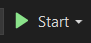

# TwistedFizzBuzz
A C# library for executing a more comprehensive version of the FizzBuzz algorithm.

## Description
This library includes the following features:

1. Execution of the original FizzBuzz algorithm;
2. Execution of the FizzBuzz algorithm with a custom set of Tokens and Divisors, as well as any range of integers;
3. Execution of the FizzBuzz algorithm for a non-sequential list of integers;
4. retrieval of a custom set of Tokens and Divisors from an external API and using them to execute the FizzBuzz Algorithm.

## API Problem and Solution
The API provided in the README of EasyChallenge (https://rich-red-cocoon-veil.cyclic.app/) is not operational. Tests were conducted both within my application itself and using Postman, where the error "Error: getaddrinfo EAI_AGAIN rich-red-cocoon-veil.cyclic.app" was returned. The solution found was to create my own API to provide Tokens and Divisors.

## FizzBuzzTokenAPI
This is a simple ASP.NET Core project, which contains a controller called TokensController, and it has an endpoint to retrieve a dictionary of type <string, int>, containing the Tokens and the corresponding Divisors, respectively. Example of return:
{ "Token1", 2 },
{ "Token2", 6 },
{ "Token3", 10 };

When running the API, it will be listening on the address "http://localhost:5096".
To retrieve the tokens correctly, you need to perform an HTTP GET at the following URL: "http://localhost:5096/api/Tokens".

## TokenMap
The TokenMap property is a dictionary of type <string, int> where tokens and their corresponding divisors are stored. This property can be updated using the UpdateTokenMap method. By default, it is configured for the original FizzBuzz algorithm:
{ "Fizz", 3 },
{ "Buzz", 5 };

## Available Methods
### Execute(int start, int end):
    Takes two integers as parameters and executes the FizzBuzz algorithm for all integers between them, inclusive. Returns a list of integers.
### Execute(List<int> inputList):
    Takes a list of integers as a parameter and executes the FizzBuzz algorithm. Returns a list of integers.
### UpdateTokenMap(Dictionary<string, int> tokenMap):
    Takes a dictionary of type <string, int>, updating the TokenMap parameter with its values. Null or empty dictionaries and the divisor 0 (zero) are not accepted. Does not return a value.
### GetTokenMap():
    Retrieves the content of the TokenMap variable, but read-only.
### UpdateTokenMapWithAPIGeneratedData():
    Retrieves a dictionary of type <string, int> from an external API and updates the TokenMap property with the result.

## Usage Example
```csharp
public static void Main()
{
    ITwistedFizzBuzz fizzBuzz = TwistedFizzBuzzFactory.CreateTwistedFizzBuzz();

    var result = fizzBuzz.Execute(1, 100);

    foreach(var res in result)
    {
        Console.WriteLine(res);
    }
}
```

## Console Applications
### StandardFizzBuzz (ConsoleApp1):
    Standard execution of the FizzBuzz algorithm.
### CustomFizzBuzz (ConsoleApp2):
    Execution of the FizzBuzz algorithm using custom Tokens and Divisors, with an input range from -20 to 127.
### NonSequentialInputFizzBuzz (ConsoleApp3):
    Execution of the FizzBuzz algorithm with a non-sequential list of integers as input: -5, 6, 300, 12, 25.
### APIGeneratedTokensFizzBuzz (ConsoleApp4):
    Execution of the FizzBuzz algorithm using custom Tokens and Divisors retrieved from an external API (https://rich-red-cocoon-veil.cyclic.app/).

## Execution Guide
1. Clone the Repository: git clone https://github.com/baradelbruno/TwistedFizzBuzz.git
2. Inside Visual Studio, select Configure Startup Projects as shown below:

3. For StandardFizzBuzz, CustomFizzBuzz and NonSequentialInputFizzBuzz, select the project at the Single Startup Project selector:

4. For the APIGeneratedTokensFizzBuzz project, the API also needs to be running and listening. Is this case, select the Multiple Startup Projects and configure it as shown:

5. Click on Start:


## Test Project
The library tests were developed using XUnit and can be found in the **TwistedFizzBuzzLibraryTests** project. Unit tests were developed for all public methods of the library, as well as for its Factory.
To execute all tests, select Test -> Run All Tests in Visual Studio, as shown below:
